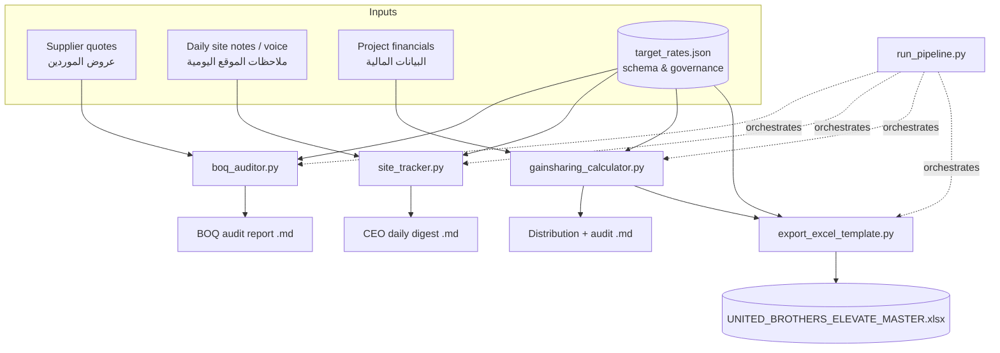

# PROJECT ELEVATE — How It Works (A → Z)
### United Brothers Co. / الاخوة المتحدين للمقاولات

A complete, plain-language walkthrough of the PROJECT ELEVATE
(Bulletproof Enterprise Edition) system — what it does, how data flows through
it, the exact governance maths, and how to run it end to end.

دليل شامل لكيفية عمل نظام "إيليفيت" من الألف إلى الياء.

---

## 1. What the system is for | الغرض

PROJECT ELEVATE turns each project period (typically a month) into a fair,
auditable **gainsharing payout** for the site team, while enforcing the
company's financial, safety, and quality guardrails. It answers three questions
every period:

1. **Did we buy well?** — audit supplier quotes vs. internal target rates.
2. **Did we perform well?** — track daily site KPIs (PPC, quality, uptime, safety).
3. **What does the team earn?** — compute the shared bonus and split it fairly.

Everything is **bilingual (EN/AR)**, branded in corporate **navy `#1B365D` / gold
`#D4AF37`**, and produces artifacts an auditor can trace to the cent.

---

## 2. The big picture — data flow | تدفق البيانات



**One config drives everything.** `target_rates.json` holds both the item
target rates *and* every governance constant (percentages, thresholds, gates).
Change a rule there and all four modules follow.

---

## 3. The period lifecycle — A → Z | دورة الفترة

| Step | Action | Module | Output |
|---|---|---|---|
| **A** | Collect supplier quotes for the period | — | `quote.txt` |
| **B** | Audit quotes vs. target rates (PPV, scope, VE) | `boq_auditor.py` | `boq_audit_report.md` |
| **C** | Capture daily site notes / voice transcripts | — | `site_notes.json` |
| **D** | Track PPC, NCR, OEE, LTI, staff hours | `site_tracker.py` | `site_daily_digest.md` |
| **E** | Enter project financials (baseline, actual, cash, etc.) | — | code / config |
| **F** | Compute savings, apply cash gate, split 80/20 & 70/30 | `gainsharing_calculator.py` | `gainsharing_result.md` |
| **G** | Apply safety gate, L&D multipliers, penalties | `gainsharing_calculator.py` | distribution DataFrame |
| **H** | Generate the branded master workbook (seeded live) | `export_excel_template.py` | `UNITED_BROTHERS_ELEVATE_MASTER.xlsx` |
| **Z** | Review, approve, pay 70% now / 30% on handover | humans | payout |

`run_pipeline.py` runs **B → H** in a single command.

---

## 4. Module-by-module | الوحدات بالتفصيل

### 4.1 `boq_auditor.py` — quote auditor
**Input:** raw supplier quote (free text, or `code | desc | unit | qty | rate | approved_vo`).
**Process:**
- Parses lines with the **Anthropic API** (`claude-3-7-sonnet-20250219`) when
  `ANTHROPIC_API_KEY` is set; otherwise a **deterministic regex parser**.
- For each line: looks up the target rate, computes **Purchase Price Variance
  (PPV)** = `quoted − target`, flags **overspend / under-target**.
- Flags **unapproved scope**: any line total `> 10,000 EGP` without a signed
  VO/Site Instruction.
- Flags **Value Engineering (VE)** candidates.

**Output:** a branded bilingual Markdown report with an executive summary,
line-by-line PPV table, unapproved-scope list, and VE opportunities.

### 4.2 `site_tracker.py` — daily site engine
**Input:** list of `{site, date, note}` (WhatsApp text or voice transcript, EN/AR).
**Process:**
- Extracts **PPC %, NCR count, OEE %, LTI count, and per-staff hours** — via the
  Anthropic API or a regex fallback (which normalizes Arabic-Indic digits
  ٠١٢٣… and only accepts single-token staff names to stay clean on prose).
- Aggregates a period, applies the **PPC ≥ 85%**, **OEE > 95%**, and
  **zero-LTI** gates.

**Output:** a branded **CEO Daily Digest** — KPI snapshot with 🟩/🟧/🟥 status,
staff hour rollup, and a safety alert banner if any LTI occurred.

### 4.3 `gainsharing_calculator.py` — the financial engine
**Input:** `ProjectFinancials` + a list of `TeamMember`s.
**Process:** the full governance cascade (see §5). **Deterministic and
side-effect-free.**
**Output:** a `GainsharingResult` bundle with three Pandas DataFrames:
- `pool_df` — savings, cash-gate, and pool figures.
- `distribution_df` — per-member base/perf/gross/immediate/retained + status.
- `audit_df` — every calculation step, in order, for dispute resolution.

### 4.4 `export_excel_template.py` — branded workbook
**Input:** `target_rates.json` and (optionally) a live `GainsharingResult`.
**Process:** builds a 5-sheet workbook (Gainsharing, Pool & Cash Gate, BOQ
Audit, Site KPIs, Governance) with navy/gold styling, **live Excel formulas**
(`SUM`/`IF`/`AND`/`COUNTA`), and status-palette **conditional formatting**.
- `--live` seeds the Gainsharing & Pool sheets from a real engine run while
  keeping every derived cell a formula, so the workbook recalculates in Excel
  and totals reconcile to line items to the cent.

**Output:** `UNITED_BROTHERS_ELEVATE_MASTER.xlsx`.

### 4.5 `run_pipeline.py` — the orchestrator
Runs all four stages A→Z, writes every artifact to `./outputs/`, and prints a
status line per stage. Each stage degrades gracefully — one failure never
blocks the others — and the process exit code is non-zero if any stage failed.

---

## 5. The governance maths | معادلات الحوكمة

### 5.1 Savings
```
C_adjusted_baseline = C_baseline + (C_baseline × Δ Material Escalation Index)
S = max(0, (C_adjusted_baseline − C_actual − BadDebt)) × F_quality
P_pool = S × 0.35            # 35% team shared pool, 65% company retention
```

### 5.2 Tiered cash liquidity gate
```
collected ≥ 85%        → unlock 100%
75% ≤ collected < 85%  → unlock pro-rata  (collected / 0.85)
collected < 75%        → unlock 0%  (full holdback)
```

### 5.3 Splits
```
Unlocked pool → 80% base equal pool + 20% performance pool
Every payout  → 70% immediate + 30% retained cushion (paid on handover)
Subcontractor back-charge reserve: 10% held before gainsharing
```

### 5.4 Individual layer
```
Eligibility (base): Section SLA met AND PPC ≥ 85%
Weight            : time_weight × L&D badge (L1 1.0 · L2 1.2 · L3 1.35)
L&D/SLA failure   : forfeit 50% of the member's base share → 20% perf pool
Unapproved scope  : additional 50% individual SLA penalty
Performance points: VE savings ×10% + Kaizen + OEE>95% + VO settle <7 days
Zero-LTI gate     : any LTI disqualifies the WHOLE team for the period
Vested resignation: clean handover keeps the 70% + vests the 30% cushion
```

### 5.5 Worked example (the shipped demo)
Inputs: baseline `12,000,000`, actual `10,400,000`, escalation `+8%` (steel),
bad debt `150,000`, F_quality `0.95`, cash collected `82%`.

```
adjusted baseline = 12,000,000 × 1.08          = 12,960,000
S = (12,960,000 − 10,400,000 − 150,000) × 0.95 =  2,289,500
team pool = 2,289,500 × 0.35                    =    801,325
cash gate: 82% is in [75%,85%) → 0.82/0.85      =     0.9647
unlocked  = 801,325 × 0.9647                    =    773,043
   base 80% = 618,434     perf 20% = 154,609
   immediate 70% = 541,130   retained 30% = 231,913
```
Team of 4: Ahmed (L3, PPC 92%) gets the largest share; Mona (L&D failed) keeps
half her base and the rest flows to the perf pool; Khaled (PPC 70%) is
ineligible; Sara (resigning, clean handover) vests her cushion.

---

## 6. How to run it | التشغيل

### Setup
```bash
cd PROJECT_ELEVATE_SYSTEM
python3 -m venv .venv && source .venv/bin/activate
pip install -r requirements.txt              # core
pip install -r requirements-optional.txt     # (optional) anthropic AI parsing
export ANTHROPIC_API_KEY="sk-ant-..."         # (optional) enables AI path
```

### The whole pipeline (recommended)
```bash
python3 run_pipeline.py                       # → ./outputs/
```

### Individual modules
```bash
python3 boq_auditor.py  --quote sample_inputs/supplier_quote.txt \
        --supplier "Delta Supplies" --project "Tower B" --out outputs/boq.md
python3 site_tracker.py --notes sample_inputs/site_notes.json \
        --period "2026-08" --out outputs/digest.md
python3 gainsharing_calculator.py             # prints the demo result
python3 export_excel_template.py --live --out outputs/MASTER.xlsx
```

### Programmatic API
```python
from gainsharing_calculator import GainsharingCalculator, ProjectFinancials, TeamMember
from export_excel_template import ElevateWorkbookBuilder

calc = GainsharingCalculator("target_rates.json")
result = calc.run(
    ProjectFinancials("Ain Sokhna WH", 12_000_000, 10_400_000,
                      cash_collected_pct=0.82, quality_factor=0.95,
                      escalation_commodity="steel_rebar", bad_debt_egp=150_000,
                      subcontractor_value_egp=3_000_000, lost_time_injuries=0),
    [TeamMember("Ahmed", "Site Manager", ld_badge="Level 3", ppc=0.92)],
)
ElevateWorkbookBuilder("target_rates.json", gainsharing_result=result)\
    .build("MASTER.xlsx")
```

---

## 7. Inputs & outputs reference | المدخلات والمخرجات

**Site note JSON** (`site_notes.json`):
```json
[{"site": "Tower B", "date": "2026-08-02",
  "note": "PPC 88%. NCR 1. OEE 96%. LTI 0. Ahmed 9h, Mona 8h."}]
```

**Quote line** (`quote.txt`, regex fallback):
```
# item_code | description | unit | qty | unit_rate_egp | approved_vo
CIV-CONC-C30 | Ready-mix concrete C30 | m3 | 250 | 2600 | no
```

**Outputs** (in `./outputs/`, git-ignored):
| File | Produced by |
|---|---|
| `boq_audit_report.md` | boq_auditor |
| `site_daily_digest.md` | site_tracker |
| `gainsharing_result.md` | gainsharing_calculator |
| `UNITED_BROTHERS_ELEVATE_MASTER.xlsx` | export_excel_template |

---

## 8. Configuration — `target_rates.json` | الإعدادات

- `governance` — every percentage/threshold (pool splits, gates, penalties).
- `cash_gate` — the three unlock thresholds.
- `ld_badges` — the L1/L2/L3 multipliers.
- `safety` — max LTI allowed (0).
- `material_escalation_index` — Δ per commodity.
- `target_rates[]` — item codes, EGP target rates, VE flags.

Edit values here to re-tune the system — **no code changes required**.

---

## 9. Offline vs AI mode | بدون / مع الذكاء الاصطناعي

- **No API key** → `boq_auditor` and `site_tracker` use their deterministic
  **regex parsers**. Fully operational, best for structured input.
- **With `ANTHROPIC_API_KEY`** → both use `claude-3-7-sonnet-20250219` to parse
  messy free-form quotes and voice transcripts, then fall back to regex if the
  API call fails.
- `gainsharing_calculator` and `export_excel_template` **never** need the API.

---

## 10. Quality, testing & CI | الجودة والاختبارات

```bash
pip install -r requirements-dev.txt
python3 -m pytest tests/ -v        # 45 tests
```
Coverage includes every governance rule (cash-gate tiers, safety gate, L&D
multipliers & forfeiture, splits), BOQ PPV/scope/VE logic, EN/AR site parsing,
and the Excel/pipeline wiring. **GitHub Actions** (`.github/workflows/ci.yml`)
runs the suite on Python 3.10/3.11/3.12 plus a pipeline smoke run on every push
and pull request to `main`.

---

## 11. Extending it | التوسعة

- **New BOQ items / rates** → add to `target_rates[]`.
- **New commodity escalation** → add to `material_escalation_index`.
- **Re-tune a rule** → edit `governance` (e.g. change the PPC gate).
- **New KPI** → extend `site_tracker`'s parser + `SiteLog` + digest.
- **New payout factor** → extend `TeamMember` + `distribute()` + a test.

Add a test in `tests/` for any rule change — CI enforces it.

---

_United Brothers Co. — PROJECT ELEVATE (Bulletproof Enterprise Edition) • Navy `#1B365D` / Gold `#D4AF37`_
